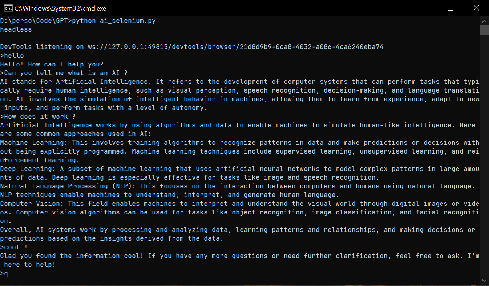

# python-AI-Selenium
A collection of free AI tools to use with python

Works using [Selenium](https://www.selenium.dev/)




# 🛠️ Dependencies

This project needs Selenium for the browser control, the Google Chrome Browser, and the [Chromedriver](https://chromedriver.chromium.org/downloads) for your Chrome version.

To install Selenium, run `pip install selenium` in the terminal.

# 🎯 Goals

This project aims to be a free and open source alternative to the large language model APIs such as the OpenAi API.
Pros:
 - Free and open source
 - no need to have a powerfull machine, juste a simple computer which can run a webbrowser
 - no credit or limit

# 📄 Documentation

Download the `python_ai.py` file and ensure that Selenium is installed and the driver for chrome is in the same folder or in the `PATH`.

The code provides different AI models from different websites.

The AI that work the best is FreeGPT.

You can use any ai model you want by importing it:

```python
from python_ai import EChat

chat = EChat()
print(chat.ask("Hello how are you ?"))
chat.close()
```

You can choose among this models:
 - `youChat` (deprecated)
 - `CodeAi` (deprecated)
 - `ChatAi` (deprecated)
 - `LLMA`
 - `FreeGPT`(deprecated)
 - **`EChat`(recommended)**
 - `MyGPT`(deprecated)

you can pass this arguments to the model:
```python
def __init__(self, view: bool = False, debug: bool = True, incognito: bool = True, executable_path: str = "chromedriver.exe")
```
- `view`: bool: if you want to see the browser
- `debug`: bool: if the app print infos
- `incognito`: bool: if the browser has to start in incognito mode
-  `executable_path`: str: the path of the ChromeDriver

# 🤝 Contribute

Feel free to contribute by adding your own model and make a pull request.
